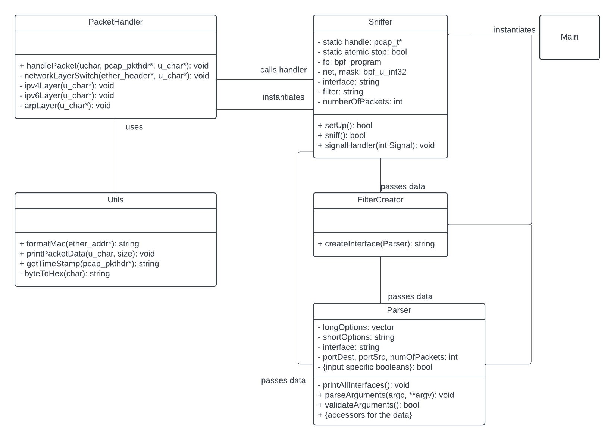
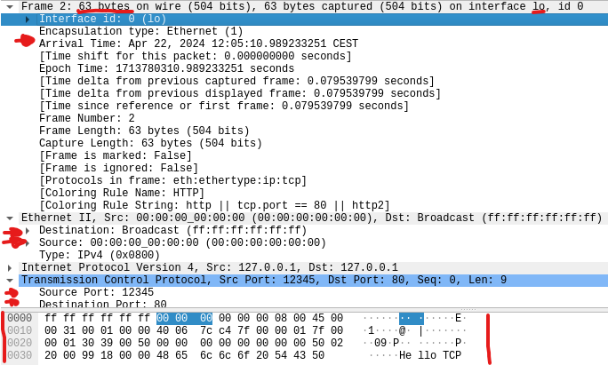

# IPK24 Sniffer


## Table of Contents
1. [General Introduction](#general-introduction)
    1. [Installation and Setup](#installation-and-setup)
    2. [Usage](#usage)
2. [Theoretical Background](#theoretical-background)
    1. [OSI model](#osi-model)
    2. [Ethernet](#ethernet)
    3. [IPv4 and IPv6](#ipv4-and-ipv6)
    4. [ARP](#arp)
    5. [ICMP](#icmp)
    6. [IGMP and MLD](#igmp-and-mld)
    7. [NDP](#ndp)
    8. [UDP and TCP](#udp-and-tcp)
3. [System Architecture](#system-architecture)
    1. [Main](#main)
    2. [Parser](#parser)
    3. [FilterCreator](#filtercreator)
    4. [Sniffer](#sniffer)
    5. [PacketHandler](#packethandler)
    6. [Utils](#utils)
4. [Testing](#testing)
5. [Additional Features](#additional-features)
6. [License](#license)
7. [Bibliography](#bibliography)


## General Introduction

This project is a sniffer developed by Marek Effenberger. It is written entirely in C++ (standard C++20), developed for the Linux operating system.
The project is a part of the IPK24 course at the Brno University of Technology. 
The goal of the project is to develop a sniffer which captures packets from the network and displays them to the user in a Wireshark-like<sup>[1]</sup> manner.
The project is heavily reliant on the pcap library<sup>[2]</sup> and a guide from Vic Hargrave<sup>[3]</sup>.

### Installation and Setup
The client is built using the Makefile. To build the client, run the following command in the root directory of the project:
```bash
make
```
This will create an executable file called `ipk_sniffer`. To run the sniffer, use the following command with the appropriate arguments described in the table below:
```bash
./ipk-sniffer [-i interface | --interface interface] {-p|--port-source|--port-destination port [--tcp|-t] [--udp|-u]} [--arp] [--ndp] [--icmp4] [--icmp6] [--igmp] [--mld] {-n num} [--help | -h]
```
| Option              | Description                                                                                      |
|---------------------|--------------------------------------------------------------------------------------------------|
| `-i`, `--interface` | Specify the network interface to sniff. Lists all active interfaces if no interface is specified. | 
| `-t`, `--tcp`       | Display TCP segments. Can be used with `-p` or port-specific options for filtering.               | 
| `-u`, `--udp`       | Display UDP datagrams. Can be used with `-p` or port-specific options for filtering.              | 
| `-p`                | Filter TCP/UDP packets based on source OR destination port.                                       | 
| `--port-destination`| Filter TCP/UDP packets based on destination port only.                                            | 
| `--port-source`     | Filter TCP/UDP packets based on source port only.                                                 | 
| `--icmp4`           | Display only ICMPv4 packets.                                                                      |
| `--icmp6`           | Display only ICMPv6 echo request/response packets.                                                | 
| `--arp`             | Display only ARP frames.                                                                          | 
| `--ndp`             | Display only NDP packets (subset of ICMPv6).                                                      | 
| `--igmp`            | Display only IGMP packets.                                                                        | 
| `--mld`             | Display only MLD packets (subset of ICMPv6).                                                      | 
| `-n`                | Specifies the number of packets to display. If not specified, defaults to displaying one packet.  | 
| `--help`, `-h`      | Display help message.                                                                             |


If no arguments are specified, the sniffer will display all available interfaces and exit. Otherwise for real use 
the interface must be specified. The -p value must not be used with the --port-source or --port-destination values at the same time.
The port specifiers can be used with the -t or -u values to filter the packets based on the source or destination port.

### Usage

After the initial setup, the sniffer is looping through the packets and displaying them to the user.
The user can stop the sniffer by pressing 'Ctrl+C' and the sniffer will shut down gracefully without 
leaving any memory leaks or other issues.


## Theoretical Background

In this section I briefly describe the theoretical background of the project, including the OSI model and the protocols and network layers used in the project.

### OSI model

The OSI model is a conceptual framework used to understand the network interactions in 7 layers, from the physical layer to the application layer.
The Sniffer is concerned with the data link layer, network layer, and transport layer of the OSI model.
Firstly, the sniffer analyzes the data link layer, analyzing the ethernet frames and extracting the IP packets.
Then the sniffer analyzes the network layer, extracting the transport layer packets.
Finally, the sniffer analyzes the transport layer.
During each step, the sniffer extracts the necessary information from the packets and displays it to the user.

### Ethernet

The Ethernet is a standard for the data link layer of the OSI model. It is used to transmit data between devices on a local network.
The Ethernet frame consists of several fields, including the destination MAC address, source MAC address, type field, and data field<sup>[5]</sup>.

### IPv4 and IPv6

The IPv4 and IPv6 are standards for the network layer of the OSI model. They are used to transmit data between devices on a global network.
Together, they are the most widely used protocol for transmitting data over the internet. More information about the IPv4 can be found here<sup>[6]</sup>.
And more information about the IPv6 can be found here<sup>[7]</sup>.

### ARP

The address resolution protocol (ARP) is used to map an IP address to a MAC address. It is used to resolve the IP address of a device to its MAC address.
It is a request-response protocol. Messages are directly encapsulated in the data link layer frames. More information about the ARP can be found here<sup>[8]</sup>.

### ICMP

ICMPv4<sup>[9]</sup> (Internet Control Message Protocol for IPv4) is used in IPv4 networks to send error messages and operational information indicating, 
for example, that a requested service is not available or that a host or router could not be reached. 
ICMPv6<sup>[10]</sup> , the version for IPv6, performs a similar role but includes additional functionalities, 
such as neighbor discovery and path MTU discovery.

### IGMP and MLD

IGMP<sup>[11]</sup> (Internet Group Management Protocol) is used to manage multicast groups in IPv4 networks. 
MLD<sup>[12]</sup> (Multicast Listener Discovery) is used to manage multicast groups in IPv6 networks.
They allow the network to use resources more efficiently by allowing multiple devices to receive the same data stream.

### NDP

NDP<sup>[13]</sup> (Neighbor Discovery Protocol) is a protocol in the Internet Protocol Suite used with IPv6. It is responsible for address resolution and neighbor discovery.
It is used to determine the link-layer addresses of neighboring nodes in the local network.

### UDP and TCP

The UDP<sup>[14]</sup> and TCP<sup>[15]</sup> are standards for the transport layer of the OSI model. They are used to transmit data between devices on a global network.
The UDP is a connectionless protocol, which contrary to the TCP lacks the reliability and error-checking mechanisms.
The TCP is a connection-oriented protocol, which sends data in byte streams, here encapsulated in the packets.


## System Architecture

The system is designed to be modular with single responsibility principle in mind. The classes are mainly 
used to encapsulate the basic logic of the system and to separate the concerns of the system.
The design pattern chosen is a combination of procedural and object-oriented programming using only single instances of classes.

The general overview of the system architecture is shown in the following simplified diagram:



Though the encapsulation divides the system into multiple classes, it is important to notice that the functions
of PacketHandler and Utils are static and are used as utility functions for the Sniffer class which works as singleton.

### Main

The main function is the entry point of the system, it instantiates the Sniffer class and after converting the
user input into inner representation and after having instantiated the Sniffer class, it calls the Sniffer's sniff method.

### Parser

The Parser class is used to parse the user input and convert it into the inner representation of the system.
It relies on the getopt_long function to parse the arguments and then converts them into the inner representation.
It also has validation methods to ensure the correctness of the user input.

### FilterCreator

The sole purpose of this class is to create the filter string for the pcap library based on the user input.

### Sniffer

The Sniffer class is the main class of the system. It is a singleton class which is used to encapsulate the logic of the system.
It has three main methods - `setUp()`, `sniff()`, and `signalHandler()`. 
The `setUp()` method is heavily utilising pcap library setup functions to create the pcap handle and set the filter.
The `sniff()` method is the main loop of the system, it is used to loop through the packets and display them to the user.
The `signalHandler()` method is used to handle the SIGINT signal and shut down the system gracefully.

### PacketHandler

The PacketHandler class is encapsulating the logic of handling the packets. It uses the netinet libraries to 
extract the necessary information from the packets and display it to the user.
It cooperates with the Utils class to convert the data into a human-readable format.

### Utils

The Utils class is a utility class used to convert the data into a human-readable format. 
It is used to convert the MAC addresses, timestamps into RFC3339<sup>[16]</sup> format, print the packet data in 
a WireShark-like manner, and to convert the byte to hex format.


## Testing

The testing was done manually by running a simple python script using the `scapy` library to send packets to the network and 
comparing the result of the sniffer to Wireshark.
The environment for testing was a Virtual Machine provided by the IPK24 course with the NIX development environment installed.
Let's presume that the sniffer is compiled and the executable is called `ipk-sniffer`.

The simple script for sending packets to the network can be found in the Gitea repository associated with this project.

<br>
1. Listing all interfaces

- The sniffer shows all available interfaces when no interface is specified.
```bash
sudo ./ipk-sniffer -i 
eth0
lo
any
bluetooth-monitor
nflog
nfqueue
```
- Comparison with listing the networks through unix command.
```bash
ls /sys/class/net/
eth0  lo
```
- Explanation: The deviations are caused by the fact that the sniffer uses pcap library function `findalldevs()` to list the interfaces.
This function can list more interfaces, such as any, or pseudo-interfaces, which are not listed in the `/sys/class/net/` directory.

<br>
2. Testing invalid arguments and their combinations

- The sniffer is provided a specific packet type, but not the interface.
```bash
sudo ./ipk-sniffer -t -u 
You have to specify an interface!
```

- The sniffer is provided with port specification but not the tcp/udp specification.
```bash
sudo ./ipk-sniffer -i eth0 -p 420
You have to specify either -t or -u
```

- The sniffer is provided with the combination of -p and --port-source. (Same result for --port-destination)
```bash
sudo ./ipk-sniffer -i eth0 -t -p 420 --port-source 421
You can only specify -p XOR (--port-source OR --port-destination).
```

As seen, the sniffer correctly handles the invalid arguments and informs the user of the correct usage.

<br>
3. Filtering specific data

- When presented with multiple packets, the sniffer correctly filters the packets based on the user input.
```bash
sudo ./ipk-sniffer -i lo --ndp -t -n 0
timestamp: 2024-04-22T11:57:30.599+02:00
src MAC: 00:00:00:00:00:00
dst MAC: ff:ff:ff:ff:ff:ff
frame length: 63 bytes
src IP: 127.0.0.1
dst IP: 127.0.0.1
TCP Packet
src port: 12345
dst port: 80

0x0000: ff ff ff ff ff ff 00 00 00 00 00 00 08 00 45 00  ..............E.  
0x0010: 00 31 00 01 00 00 40 06 7c c4 7f 00 00 01 7f 00  .1....@.|.......  
0x0020: 00 01 30 39 00 50 00 00 00 00 00 00 00 00 50 02  ..09.P........P.  
0x0030: 20 00 99 18 00 00 48 65 6c 6c 6f 20 54 43 50      .....Hello TCP


timestamp: 2024-04-22T11:57:31.009+02:00
src MAC: 00:00:00:00:00:00
dst MAC: ff:ff:ff:ff:ff:ff
frame length: 86 bytes
src IP: ::1
dst IP: ::1
ICMP6 Packet
ICMP6 type: NDP

0x0000: ff ff ff ff ff ff 00 00 00 00 00 00 86 dd 60 00  ..............`.
0x0010: 00 00 00 20 3a ff 00 00 00 00 00 00 00 00 00 00  ... :...........
0x0020: 00 00 00 00 00 01 00 00 00 00 00 00 00 00 00 00  ................
0x0030: 00 00 00 00 00 01 87 00 71 98 00 00 00 00 00 00  ........q.......
0x0040: 00 00 00 00 00 00 00 00 00 00 00 00 00 01 01 01  ................
0x0050: 00 01 02 03 04 05                                ......


timestamp: 2024-04-22T11:57:31.009+02:00
src MAC: 00:00:00:00:00:00
dst MAC: 00:00:00:00:00:00
frame length: 78 bytes
src IP: ::1
dst IP: ::1
ICMP6 Packet
ICMP6 type: NDP

0x0000: 00 00 00 00 00 00 00 00 00 00 00 00 86 dd 60 00  ..............`.
0x0010: 00 00 00 18 3a ff 00 00 00 00 00 00 00 00 00 00  ....:...........
0x0020: 00 00 00 00 00 01 00 00 00 00 00 00 00 00 00 00  ................
0x0030: 00 00 00 00 00 01 88 00 37 aa 40 00 00 00 00 00  ........7.@.....
0x0040: 00 00 00 00 00 00 00 00 00 00 00 00 00 01        ..............
```

- The data sent can be seen here:


- Explanation: The sniffer correctly filters the packets based on the user input. The input specified TCP packets and NDP packets.
The -n 0 means to capture indefinitely. When presented with multiple packets as seen in the Wireshark capture, the sniffer correctly
filtered the ones that matched the user input.

<br>
4. Correctness of the output

- The sniffer correctly displays the packet data in a Wireshark-like manner.
```bash
sudo ./ipk-sniffer -i lo -t
timestamp: 2024-04-22T12:05:10.989+02:00
src MAC: 00:00:00:00:00:00
dst MAC: ff:ff:ff:ff:ff:ff
frame length: 63 bytes
src IP: 127.0.0.1
dst IP: 127.0.0.1
TCP Packet
src port: 12345
dst port: 80

0x0000: ff ff ff ff ff ff 00 00 00 00 00 00 08 00 45 00  ..............E.  
0x0010: 00 31 00 01 00 00 40 06 7c c4 7f 00 00 01 7f 00  .1....@.|.......  
0x0020: 00 01 30 39 00 50 00 00 00 00 00 00 00 00 50 02  ..09.P........P.  
0x0030: 20 00 99 18 00 00 48 65 6c 6c 6f 20 54 43 50      .....Hello TCP
```

- The Wireshark capture can be seen here: (the data which sniffer supports are pinpointed with the red arrow)



- Explanation: The sniffer correctly displays the packet data in a Wireshark-like manner. The data is correctly displayed in the same format as in Wireshark.

<br>
5. SIGINT handling and memory leaks

- The sniffer correctly handles the SIGINT signal and shuts down gracefully without leaving any memory leaks.
```bash
 sudo valgrind ./ipk-sniffer -i lo -t -n 0
==12796== Memcheck, a memory error detector
==12796== Copyright (C) 2002-2017, and GNU GPLd, by Julian Seward et al.
==12796== Using Valgrind-3.15.0 and LibVEX; rerun with -h for copyright info
==12796== Command: ./ipk-sniffer -i lo -t -n 0
==12796==
timestamp: 2024-04-22T12:13:04.769+02:00
src MAC: 00:00:00:00:00:00
dst MAC: ff:ff:ff:ff:ff:ff
frame length: 63 bytes
src IP: 127.0.0.1
dst IP: 127.0.0.1
TCP Packet
src port: 12345
dst port: 80

0x0000: ff ff ff ff ff ff 00 00 00 00 00 00 08 00 45 00  ..............E.
0x0010: 00 31 00 01 00 00 40 06 7c c4 7f 00 00 01 7f 00  .1....@.|.......
0x0020: 00 01 30 39 00 50 00 00 00 00 00 00 00 00 50 02  ..09.P........P.
0x0030: 20 00 99 18 00 00 48 65 6c 6c 6f 20 54 43 50      .....Hello TCP


^CSIGINT received, preparing to shut down...
==12796==
==12796== HEAP SUMMARY:
==12796==     in use at exit: 0 bytes in 0 blocks
==12796==   total heap usage: 50 allocs, 50 frees, 100,490 bytes allocated
==12796==
==12796== All heap blocks were freed -- no leaks are possible
==12796==
==12796== For lists of detected and suppressed errors, rerun with: -s
==12796== ERROR SUMMARY: 0 errors from 0 contexts (suppressed: 0 from 0)
```

- Explanation: The sniffer correctly handles the SIGINT signal and shuts down gracefully without leaving any memory leaks.
It shows a short message to the user and then exits.

## Additional Features

On top of the requirement the sniffer informs user of the specific packet type. 
It also informs the user of the individual packet subtype. 
The addition of these data is to provide the user with more friendly and informative output.


## License

This code is licensed under the GNU General Public License v3.0. For more information, see the LICENSE file in the root directory of the project.


## Bibliography

[Wireshark] _Wireshark_ [online]. [cited 2024-04-21]. Available at: https://www.wireshark.org/

[pcap] _pcap library_ [online]. [cited 2024-04-21]. Available at: https://www.tcpdump.org/pcap.html

[Guide to Sniffer] Hargrave, V. _Develop a packet sniffer with libpcap_ [online]. [cited 2024-04-21]. Available at: https://vichargrave.github.io/programming/develop-a-packet-sniffer-with-libpcap/

[OSI model] _OSI model_ [online]. [cited 2024-04-21]. Available at: https://en.wikipedia.org/wiki/OSI_model

[Ethernet frame] _Ethernet frame_ [online]. [cited 2024-04-21]. Available at: https://en.wikipedia.org/wiki/Ethernet_frame

[IPv4] _IPv4_ [online]. [cited 2024-04-21]. Available at: https://en.wikipedia.org/wiki/Internet_Protocol_version_4

[IPv6] _IPv6_ [online]. [cited 2024-04-21]. Available at: https://en.wikipedia.org/wiki/IPv6

[ARP] _ARP_ [online]. [cited 2024-04-21]. Available at: https://en.wikipedia.org/wiki/Address_Resolution_Protocol

[ICMPv4] Postel, J. _ICMPv4_ [online]. [cited 2024-04-21]. Available at: https://datatracker.ietf.org/doc/html/rfc792

[ICMPv6] Conta, A., Transwitch, Deerin, S., Cisco Systems, Gupta, M. Ed., Tropos Networks _ICMPv6_ [online]. [cited 2024-04-21]. Available at: https://datatracker.ietf.org/doc/html/rfc4443

[IGMP] Cain, B., Cereva Networks, Deering, S., Kouvelas, I., Cisco Systems, Fenner, B., AT&T Labs - Research, Thyagarajan, A., Ericsson _IGMP_ [online]. [cited 2024-04-21]. Available at: https://datatracker.ietf.org/doc/html/rfc3376

[MLD] Deering, S., Cisco Systems, Fenner, W., AT&T - Research, Haberman, B., IBM _MLD_ [online]. [cited 2024-04-21]. Available at: https://datatracker.ietf.org/doc/html/rfc2710

[NDP] Narten, T., IBM, Nordmark, E., Sun Microsystems, Simpson, W., Daydreamer, Soliman, H., Elevate Technologies _NDP_ [online]. [cited 2024-04-21]. Available at: https://datatracker.ietf.org/doc/html/rfc4861

[UDP] Postel, J. _UDP_ [online]. [cited 2024-04-21]. Available at: https://datatracker.ietf.org/doc/html/rfc768

[TCP] Information Sciences Institute, University of Southern California _TCP_ [online]. [cited 2024-04-21]. Available at: https://datatracker.ietf.org/doc/html/rfc793

[RFC3339] Klyne, G., Clearswift Corporation, Newman, C., Sun Microsystems _RFC3339_ [online]. [cited 2024-04-21]. Available at: https://tools.ietf.org/html/rfc3339


[1]: https://www.wireshark.org/
[2]: https://www.tcpdump.org/pcap.html
[3]: https://vichargrave.github.io/programming/develop-a-packet-sniffer-with-libpcap/
[4]: https://en.wikipedia.org/wiki/OSI_model
[5]: https://en.wikipedia.org/wiki/Ethernet_frame
[6]: https://en.wikipedia.org/wiki/Internet_Protocol_version_4
[7]: https://en.wikipedia.org/wiki/IPv6
[8]: https://en.wikipedia.org/wiki/Address_Resolution_Protocol
[9]: https://datatracker.ietf.org/doc/html/rfc792
[10]: https://datatracker.ietf.org/doc/html/rfc4443
[11]: https://datatracker.ietf.org/doc/html/rfc3376
[12]: https://datatracker.ietf.org/doc/html/rfc2710
[13]: https://datatracker.ietf.org/doc/html/rfc4861
[14]: https://datatracker.ietf.org/doc/html/rfc768
[15]: https://datatracker.ietf.org/doc/html/rfc793
[16]: https://tools.ietf.org/html/rfc3339


